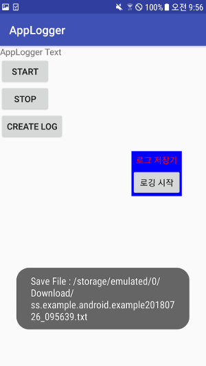

# AppLogger
플로팅 뷰를 이용해 어플리케이션에 발생하는 로그(logcat)를 파일로 저장하는 서비스 입니다.

### Example App  


### Start Service
```java
 try {
    AppLogger.start(this);
} catch (PermissionManageOverlayException e) {
    //Todo : Add permission
} catch (PermissionWriteExternalStorageException e) {
    //Todo : Add permission
}
```

### Stop Service
```java
AppLogger.stop(this);
```